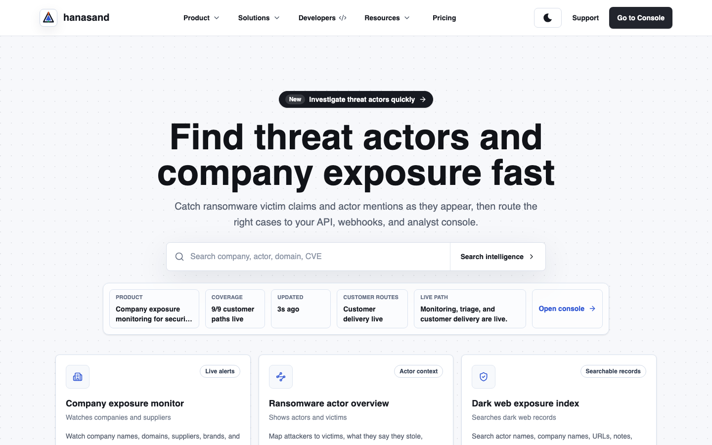
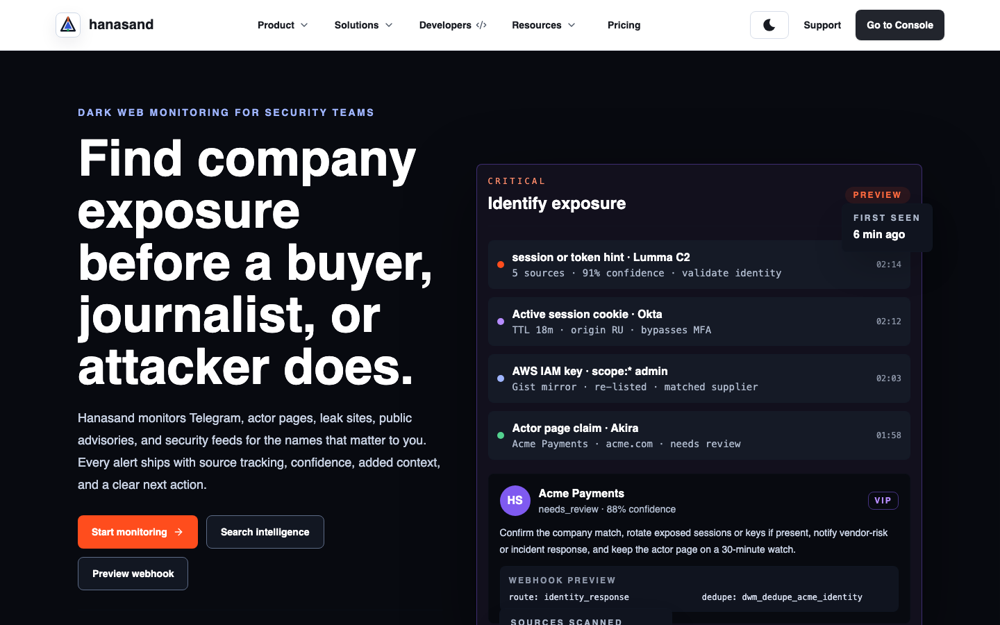
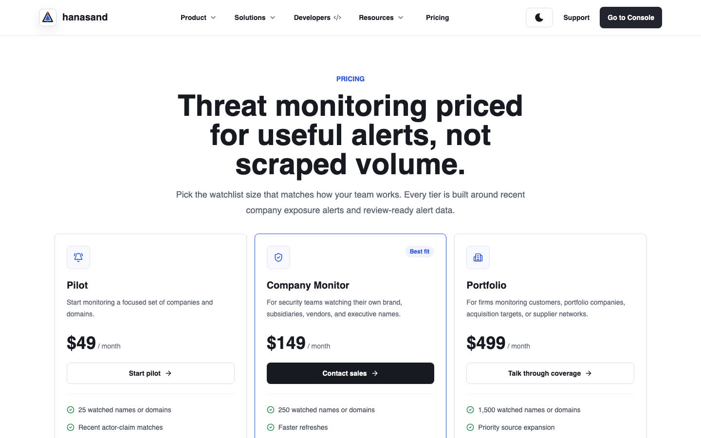
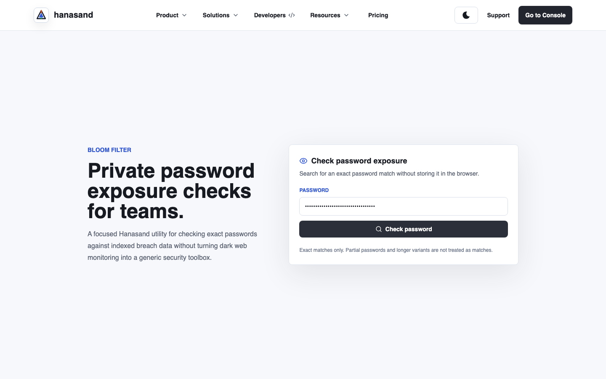
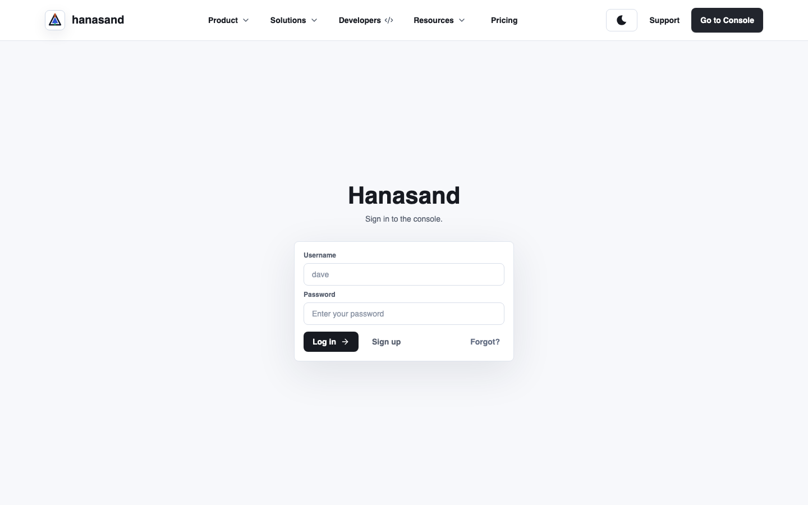
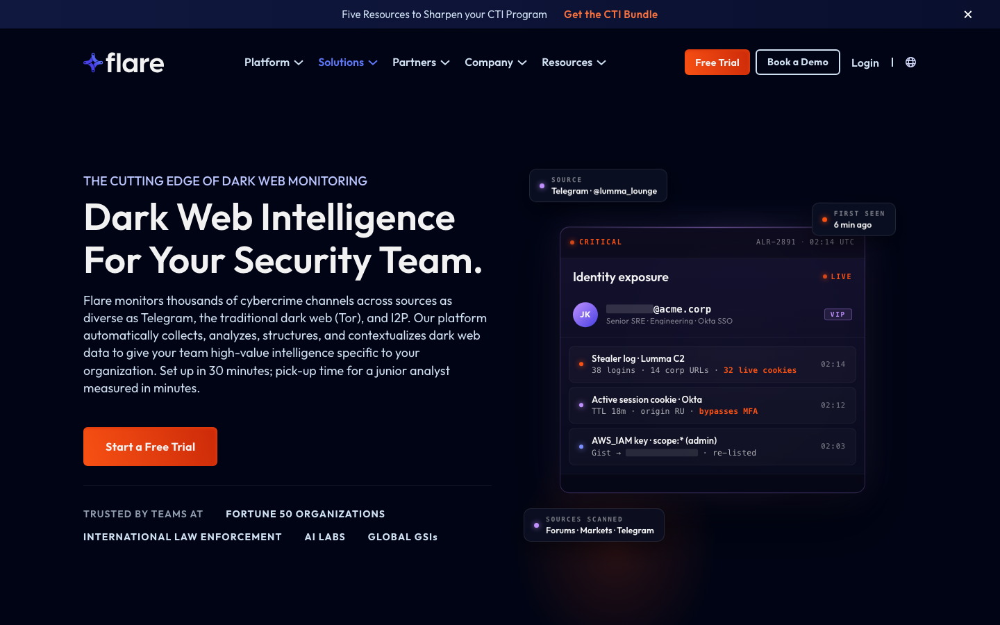
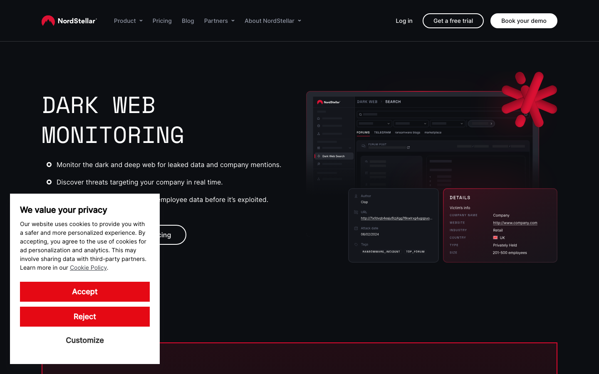
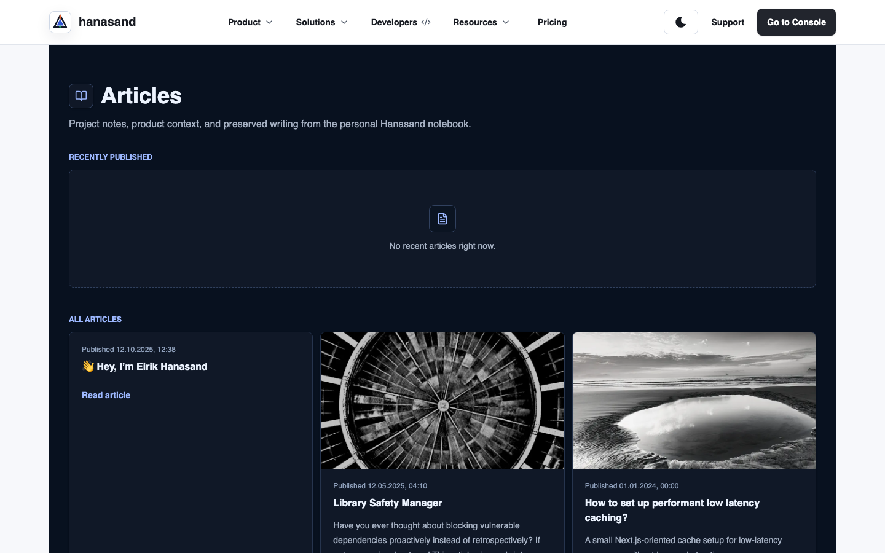

# Hanasand End-to-End Critical Website Audit

Date: 2026-07-03
Auditor stance: extremely critical, top-5-in-industry bar
Primary site: <https://hanasand.com>
Comparators: <https://flare.io/dark-web-monitoring>, <https://nordstellar.com/dark-web-monitoring/>

## Executive Verdict

Hanasand has credible product direction and some genuinely useful live functionality, especially the public threat-intelligence search. It also has a much stronger price/on-ramp story than the larger competitors. But it is not currently close to enterprise-ready for a large organization to adopt immediately.

The main blockers are trust and proof, not just design. The site makes strong claims about dark web, Telegram, identity exposure, session tokens, webhooks, and analyst workflows, but public proof is thin, some testimonials are not verifiable, the contact flow is only `mailto:`, the password checker workflow appears broken or unclear, the public API host failed TLS checks during audit, and the authenticated dashboard evidence shows several operational lanes marked unavailable. A large enterprise buyer would not be able to complete diligence from the site.

Final score for “how good and ready is Hanasand for a large organization to start using right now”: **42/100**.

Breakdown:

| Area | Score | Reason |
| --- | ---: | --- |
| SOC analyst usefulness | 64/100 | Live TI search returns recent evidence and the DWM page uses analyst-relevant fields, but pages are dense and several claims feel demo-heavy. |
| Non-specialist buyer clarity | 47/100 | The site explains the category in places, but still assumes knowledge of actors, webhooks, source families, metadata-only collection, NHI, and analyst routing. |
| Visual/design quality | 66/100 | Clean, modern Hanasand pages are mostly polished; DWM is strong. Some dark-mode contrast issues and dense dashboard areas reduce confidence. |
| Workflow reliability | 45/100 | Search works. Dashboard auth gate works. Contact, pwned, webhook preview, registration, and enterprise onboarding are weak or incomplete. |
| Enterprise trust/readiness | 31/100 | Missing SOC 2/ISO/DPA/security docs, verifiable customer proof, SSO/procurement path, admin onboarding clarity, SLA, and public subprocessor list. |
| Competitive positioning | 44/100 | Hanasand is cheaper and more direct, but Flare and NordStellar present much stronger enterprise proof, coverage claims, reviews, and buyer flow. |

## Evidence Collected

Artifacts:

- Browser capture JSON: [browser-capture-results.json](./browser-capture-results.json)
- Additional public-page capture JSON: [additional-public-page-captures.json](./additional-public-page-captures.json)
- Screenshot folder: [screenshots](./screenshots)
- Key Hanasand screenshots:
  - 
  - 
  - 
  - 
  - 
- Key competitor screenshots:
  - 
  - 

Live probes run:

- `https://hanasand.com/`, `/solutions`, `/solutions/dwm`, `/pricing`, `/developers`, `/ti`, `/pwned`, `/upload`, `/status`, `/readiness`, `/contact`, `/login`, `/register`, `/dashboard`, `/privacy`, `/cookies`, `/cookie-settings`
- Clean anonymous `/dashboard` correctly redirected to `/login?path=%2Fdashboard`.
- Live `POST https://hanasand.com/api/ti/search` with `acworth-ga.gov` returned ready public-intelligence results.
- Live `https://api.hanasand.com/api/status` and `https://api.hanasand.com/api/pwned` failed TLS from curl with `tlsv1 alert internal error`.
- Password checker UI was tested with synthetic input. After seven seconds it still showed the entered value and no result/error in the captured screenshot.
- Remaining public sitemap pages were captured in clean sessions: About, Articles, individual articles, Eirik pages, Onion Session, Terms, Service Check, and Readiness.

Important limitation:

- I did not create a production account, submit the contact form, or submit registration because those create external side effects. Authenticated dashboard evidence came from the available browser session and source inspection; anonymous behavior was verified separately with clean sessions.

## Page-by-Page Hanasand Findings

### Home

What works:

- The clean desktop hero is visually modern and direct: “Find threat actors and company exposure fast.”
- The search bar is prominent and ties to a real workflow.
- The readiness strip creates a good “live product” signal.

Negative points:

- The page tries to serve SOC analysts, buyers, and developers at once. The first screen says “threat actors,” “company exposure,” “API,” “webhooks,” and “analyst console” before explaining the business outcome in plain language.
- For a non-specialist, “actor mentions” and “ransomware victim claims” are understandable only after some domain context.
- The “Open console” / “Go to Console” language appears before the buyer knows what the console contains.
- The site lacks an immediate “see sample alert” or “sample report” CTA above the fold, which both SOC analysts and non-technical buyers would understand.

Competitive comparison:

- **Flare wins** for enterprise confidence: it immediately claims thousands of channels, Telegram/Tor/I2P coverage, setup time, junior analyst learnability, and trusted customer categories.
- **NordStellar wins** for buyer simplicity: it says monitor leaked data and company mentions, then offers demo/free trial.
- **Hanasand wins** on low-friction search access, but loses on proof and plain-language positioning.

### Dark Web Monitoring Page

What works:

- This is Hanasand’s strongest public page visually.
- The hero is concrete: company exposure before a buyer, journalist, or attacker sees it.
- The threat console visual uses SOC-relevant fields: source, confidence, first seen, identity response, session/token hints, source scans, webhook preview.
- The page includes useful product concepts: no raw leak downloads, metadata-first collection, source records, hashes, screenshots when approved.

Negative points:

- It overpromises relative to visible public evidence. The page suggests Telegram, actor pages, leak sites, public advisories, session cookies, OAuth tokens, API keys, and NHI compromise coverage. The live public search evidence I verified returned recent ransomware.live-style victim rows, not proof of the full claimed coverage.
- Several high-impact claims look like demo data. If they are demo data, they need explicit labeling. A large buyer will ask, “Is this real coverage or staged UI?”
- “Preview webhook” stages local state and redirects to `/dashboard/automations?setup=dwm`. For anonymous users this becomes a login/register path rather than a clear “here is the payload” workflow.
- The language is excellent for a SOC analyst but still too dense for a CFO, legal reviewer, or procurement lead.

Competitive comparison:

- **Flare wins** on breadth and depth claims: identity exposure, stealer logs, session replay, NHI compromise, takedown, API, Okta/Sentinel/ServiceNow/Slack/Jira/Entra integrations, and indefinite searchable retention are all stated on-page.
- **NordStellar wins** on structured buying flow: scan, demo, pricing, testimonials, and quantified claims.
- **Hanasand wins** on showing a concise alert/workflow model, but loses because the evidence behind the model is not yet independently proven.

### Threat Intelligence Search

What works:

- Live query worked. `acworth-ga.gov` returned a ready result with two public-intelligence rows, timestamps, source names, metadata-only state, actor/victim fields, provenance hashes, and collection strategy.
- This is the most credible “real product” proof found during the audit.
- A SOC analyst can get value if they already understand ransomware victim feeds and source provenance.

Negative points:

- The UI is likely too dense for a non-specialist. It contains filters, evidence, source posture, actionability, handoff concepts, and dashboard links that assume analyst maturity.
- The live JSON showed extensive internal product language: quality gates, evidence stage labels, source posture, owned collection targets, prohibited actions. That is useful internally, but customer-facing copy should translate it into “what happened, why it matters, what to do next.”
- Some command links point to authenticated dashboard flows; if the user is not logged in, the product path becomes abrupt.

Competitive comparison:

- **Hanasand wins** on publicly accessible live search. Flare/NordStellar push harder toward trial/demo.
- **Flare wins** on analyst action narrative: validate against IdP, lock accounts, revoke sessions, takedown.
- **NordStellar wins** on user-friendly “domain in, results out” story.

### Pricing

What works:

- Pricing is clear, simple, and refreshingly visible.
- $49/$149/$499 monthly tiers are easy to understand.
- The “watched names or domains” unit is good.

Negative points:

- For large organizations, the prices may reduce trust rather than increase it. Enterprise security buyers expect security controls, SLA, support, procurement, compliance, and onboarding. Very low pricing without proof can read as hobbyist or early beta.
- Customer quotes use names and roles but no company logos, case studies, verification, review platform, dates, or permissions language. This is a serious trust gap.
- “Load testing” pricing appears on the same page as threat monitoring. That dilutes positioning and makes the company feel unfocused.
- There is no enterprise plan, no procurement path, no data residency note, no DPA link, no SSO/SAML note, no SLA, no support tier.

Competitive comparison:

- **NordStellar wins** on enterprise price framing: it lists Essential “From $5000/year,” higher plans, and unlimited users. That price may be less accessible, but it feels more enterprise-plausible.
- **Flare wins** on high-confidence sales motion: free trial/demo plus enterprise trust categories.
- **Hanasand wins** on affordability, but loses on enterprise credibility.

### Contact / Sales

What works:

- The form is simple and intent-aware.
- The fields are not invasive.
- It makes clear that direct email is available.

Negative points:

- Submitting only opens a drafted `mailto:` link. This is not acceptable for top-tier B2B security sales. It can fail silently if the user has no mail client configured.
- No confirmation screen, ticket ID, CRM capture, calendar booking, demo scheduling, SLA expectation, or “we received it.”
- For large organizations, this is a procurement dead end.

Competitors:

- **Flare and NordStellar win** because they offer demo/trial flows that feel like mature sales motions.

### Login / Register / Auth Gate

What works:

- Clean anonymous `/dashboard` redirects to login.
- Register has strong password requirements and reserved username handling.
- Login/register pages are visually clean.

Negative points:

- Registration asks for username/name/password, not business email, organization, company domain, plan, invite, or tenant context. That is not enterprise onboarding.
- No visible SSO/SAML/OIDC, SCIM, MFA, or enterprise identity story.
- Password rules are strict, but strict composition rules alone do not equal enterprise auth maturity.
- Login placeholder “dave” feels too casual for a security product.

Competitors:

- **Flare/NordStellar win** because the buyer path is demo/trial/sales-led, not casual account creation.

### Dashboard / Authenticated Product

What works:

- Authenticated evidence shows a rich operations workbench.
- The dashboard has analyst lanes, cases, source coverage, delivery/workflow concepts, and many admin/system surfaces.
- Route source shows many dashboard pages are protected by token checks.

Negative points:

- Authenticated capture showed many “unavailable” states in workbench lanes. That damages readiness perception.
- The operations console copy is dense and internal. “Codex, work the queue,” “backed inspection,” “source inventory proxy,” and “alert generation state is updating” do not read like enterprise customer copy.
- The dashboard seems more like an internal operator console than a polished customer admin product.
- Large organizations need obvious tenant isolation, audit logs, role policy, SSO, webhook safety, evidence retention, export, and escalation workflows. Some of these may exist in code, but the site does not make them buyer-verifiable.

Competitors:

- **Flare wins** on public explanation of analyst actions and integrations.
- **NordStellar wins** on visible product screenshots and buyer-ready categories.
- **Hanasand may have deep internal functionality**, but the public/authenticated copy does not yet project enterprise reliability.

### Password Exposure Checker

What works:

- The idea is useful.
- The UI states “exact matches only” and tries to avoid turning the site into a generic toolbox.

Critical negative points:

- Live UI test with synthetic input did not show a result or error after waiting.
- Direct `https://api.hanasand.com/api/pwned` and `/api/status` checks failed TLS from curl.
- The frontend source sends the full password in JSON to the API. Even if the backend uses k-anonymity downstream, asking users to type a real password into a vendor page is a major trust problem. This should be redesigned or heavily clarified.
- The status page said all systems operational while this workflow/API path was failing from audit probes.

Recommendation:

- Remove this from the main buyer journey until it is reliable and rewritten around client-side SHA-1 prefix/k-anonymity disclosure, or frame it as an internal demo with explicit warnings.

### Upload

Negative points:

- Public `/upload` appears unrelated to the dark web monitoring buyer journey.
- A generic upload page creates unnecessary risk and confusion unless tightly explained.
- For a security buyer, public upload surfaces invite questions about malware handling, file retention, scanning, abuse controls, and data classification.

Recommendation:

- Hide from primary nav/sitemap unless it has a specific, documented use case and security boundary.

### Service Check / Load Testing

What works:

- `/test` is visually more polished than expected and clearly warns “Always get permission before testing.”
- The “5 free checks remaining” constraint is easy to understand.

Negative points:

- This workflow is not aligned with dark web monitoring. Endpoint checks/load testing might be useful, but on the same domain and pricing page it dilutes the product identity.
- A public endpoint-check form raises abuse, rate-limit, legal, and customer-support questions. The page says permission is required, but it does not show detailed acceptable-use enforcement, scan scope, or what requests will be sent.
- The page does not make clear whether results are private, shared, retained, or visible in “Global Recent Scans.”

### Articles / Personal Pages

Evidence:

- Public sitemap includes `/articles`, `/articles/bot`, `/articles/cache`, `/articles/event`, `/articles/lsm`, `/articles/readme`, `/articles/theme`, `/eirik`, and `/eirik/motivation`.
- Articles page screenshot: 

What works:

- The Articles page is visually coherent with the newer dark dashboard/marketing theme.
- Some technical writing may help founder credibility.

Negative points:

- These pages are not aligned with enterprise dark web monitoring. Discord bot guides, React Native event apps, caching notes, personal README content, and a motivation wall make the site feel like a personal portfolio mixed into a security product.
- The Articles page uses date formatting that can be ambiguous for international buyers, and the content taxonomy is confusing.
- “Project notes, product context, and preserved writing from the personal Hanasand notebook” does not project enterprise vendor maturity.
- For a top-five industry bar, personal/dev content should be separated from the product buyer journey or clearly framed as founder blog/research.

### About / Onion Session

What works:

- About reinforces the company-exposure positioning.
- Onion Session has a clearer security boundary than generic upload/load-testing pages: controlled onion review without moving raw material onto analyst machines is a relevant story.

Negative points:

- These pages need stronger proof and policy language. If onion review is a real product, buyers need isolation architecture, retention, analyst permissioning, evidence export, and legal/safety boundaries.
- The About page still reads more like product copy than company trust proof. It should answer who operates Hanasand, where the company is incorporated, how support works, what security controls exist, and why a buyer should trust it.

### Status / Readiness

What works:

- A public status page is good.
- Readiness/product-progress APIs suggest active operational instrumentation.

Negative points:

- Status credibility is hurt if public API TLS paths or pwned workflow fail while the page says all systems operational.
- Large customers expect incident history, component-level status, uptime history, webhook/API region status, and subscription options.

### Legal / Cookie Settings

What works:

- Privacy, cookie, and terms pages are much stronger than typical early-stage filler.
- Cookie settings are visually modern and give real controls without exposing username/theme controls.

Negative points:

- Missing enterprise artifacts: DPA, subprocessor list, security overview, data retention schedule, breach notification terms, compliance page, trust center.
- Legal pages are good, but not enough for enterprise diligence alone.

## Copy Comprehension

SOC analyst:

- Strengths: “ransomware victim claims,” “source tracking,” “confidence,” “webhook payload,” “metadata-only,” “actor page,” “session cookie,” and “source family” are relevant.
- Weaknesses: copy sometimes reads as internal roadmap rather than user-facing product proof. It needs more sample triage outcomes and fewer internal system labels.

Non-specialist buyer:

- Strengths: “Find company exposure before a buyer, journalist, or attacker does” is excellent.
- Weaknesses: many pages assume knowledge of threat actors, Tor, Telegram, infostealer logs, OAuth tokens, NHI, webhook delivery, and source provenance.
- Needed: a simple story like “Tell us your company/domain/vendors. We alert you when they appear in criminal leak/extortion sources. You get a short report with what happened, proof, severity, and next steps.”

## Styling and Contrast

Hanasand positives:

- Clean-session home and pricing pages are visually polished.
- Card radii, typography, spacing, and icon use are generally modern.
- DWM page has a compelling operations-console aesthetic.

Hanasand negatives:

- Automated contrast scan in the authenticated/dark-mode capture flagged low-contrast items, including dark-mode home/dashboard pills and TI cards. Examples from capture JSON: ratios around `1.02` on TI sample cards and around `3.26-3.4` on dashboard status labels. These need manual WCAG pass/fail review because some may be decorative, but they are concerning.
- Dense dashboard panels feel like internal admin tooling, not a customer-ready enterprise product.
- Some pages are visually from different eras: light marketing pages, dark DWM, dense dashboard, generic utility pages.

Competitor styling:

- **Flare**: best first impression for a mature CTI buyer. It is polished, credible, and specific. Negative: very dark, visually dense, and some small text could be tough in real use.
- **NordStellar**: clear buyer path and recognizable brand quality. Negative: the cookie banner blocks the hero and the red-on-dark/white CTA system has contrast and interruption issues.
- **Hanasand**: more lightweight and accessible than Flare/Nord in places, but less cohesive and less proof-backed.

## Competitor Comparison by Feature

| Feature | Best | Hanasand | Flare | NordStellar |
| --- | --- | --- | --- | --- |
| Immediate category clarity | NordStellar | Clear enough for SOC, less clear for executives | Strong but CTI-heavy | Very clear: monitor leaked data/company mentions |
| First-screen visual polish | Flare | Good on clean home/DWM | Best mature/security aesthetic | Good but cookie modal damages first impression |
| Live free workflow | Hanasand | Public TI search works | Trial/demo oriented | Free scan but asks for work email/consent |
| Enterprise trust proof | Flare | Weak; no verifiable customers/compliance | Fortune 50/law enforcement categories, integrations, docs/status links | G2 reviews, named testimonials/logos, quantified source claims |
| Coverage claims | Flare | Claims Telegram/leak sites/advisories but proof thin | Thousands of channels, Telegram/Tor/I2P, sessions/NHI/takedown | 40K+ sources, 100B+ leaked credentials, 75M+ malware logs |
| Analyst workflow | Flare | Strong intent, dense execution | Best action narrative: validate, lock, revoke, takedown, integrate | Good but higher-level |
| Pricing transparency | NordStellar/Hanasand | Very transparent but too low for enterprise trust | Less transparent on page | Transparent starting enterprise price |
| Reviews/social proof | NordStellar | Unverified quotes only | Official testimonials/categories | G2 5/5 from 5 reviews plus named page testimonials |
| API/integrations | Flare | Mentions API/webhooks; workflow proof partial | Strong: REST, webhooks, Okta, Sentinel, ServiceNow, Slack, Jira, Entra | Alerts to email/Slack/Teams and API category pages |
| Enterprise readiness | Flare | Not ready right now | Most ready from public evidence | More ready than Hanasand, less analyst-depth proof than Flare |

## Public Review / Proof Notes

Flare official page evidence:

- Claims monitoring across Telegram, Tor, and I2P; automatic collection, analysis, structuring, and contextualization; setup in 30 minutes; junior analyst pickup in minutes.
- Claims trusted teams include Fortune 50 organizations, international law enforcement, AI labs, and global GSIs.
- Claims identity exposure, infostealer logs, phishing-kit credentials, session replay, and NHI compromise handling.
- Claims REST/webhooks and native integrations with Azure Sentinel, Okta, ServiceNow, Slack, Jira, and Entra ID.

NordStellar official/G2 evidence:

- Official page claims dark/deep web monitoring, company mentions, free scan, alerts across email/Slack/Teams, source context, screenshots, 40K+ sources, 100B+ leaked credentials, 75M+ malware logs, and pricing from $5000/year.
- G2 page shows 5/5 from 5 reviews, all mid-market, all 5-star. Review excerpts emphasize easy setup, user-friendly interface, real-time alerts, and useful insights.

Hanasand evidence:

- Live TI search worked and returned current, structured public intelligence.
- Public pages are improving fast, but no independent review platform, no named customer logos, no public case studies, no security/compliance trust center, and no procurement artifacts were found in the audited buyer journey.

## Highest-Priority Fixes

1. Fix or remove the password exposure checker.
   - Public API TLS must work.
   - UI must show deterministic loading/error/result states.
   - Do not ask users to submit real passwords to a SaaS page without a very explicit privacy/security model.

2. Build an enterprise trust center.
   - Security overview, DPA, subprocessors, retention, data residency, encryption, access controls, incident response, vulnerability disclosure, responsible disclosure, uptime/status history.

3. Replace unverifiable testimonials.
   - Use real logos, permissioned quotes, case studies, or remove them. Fake-looking quotes are worse than no quotes.

4. Make DWM claims evidence-backed.
   - Label demo data.
   - Add a sample alert packet and sample redacted report.
   - Show what sources are live today vs planned.
   - Show metadata-only safety boundaries.

5. Upgrade contact/sales workflow.
   - Server-side form submission, confirmation, ticket ID, calendar/demo option, plan context, CRM/email backup.

6. Clarify buyer journey for non-experts.
   - Add “How it works” in plain English: watchlist, monitor, verify, alert, act.
   - Add examples for SOC, vendor-risk, executive, legal/comms.

7. Separate unrelated products.
   - Load testing and generic upload dilute the dark web monitoring value proposition.

8. Add enterprise auth/onboarding proof.
   - SSO/SAML/OIDC, SCIM, MFA, roles, tenant isolation, audit logs, webhook signing, SIEM/SOAR integrations, onboarding timeline.

9. Run a formal contrast/accessibility pass.
   - Especially dark-mode dashboard, TI cards, status labels, and small pill text.

10. Tighten dashboard language.
   - Replace internal/system phrases with customer-understandable operational states and next actions.

## Final Assessment

Hanasand is promising, but today it reads like a highly capable early product with a real search backend, a strong product taste in places, and incomplete enterprise wrapping. A SOC analyst may find the live search interesting. A buyer may like the price. A large organization will stop at trust, proof, procurement, reliability, and compliance.

Against Flare and NordStellar:

- **Flare is currently best for enterprise dark web monitoring credibility and analyst depth.**
- **NordStellar is currently best for buyer clarity, review proof, pricing frame, and simple scan/demo funnel.**
- **Hanasand is currently best for low-friction public search and affordability, but weakest on enterprise readiness.**

Final score: **42/100**.

Large-organization readiness right now: **not ready without a serious trust/procurement/reliability pass and clearer proof of live coverage.**
